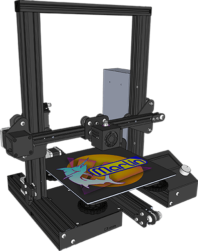

<h1 align="center">Creality Ender-3 AIO Marlin Firmware</h1>

    
    
    
    
    
     
    

## Configuring Ender-3 All-in-One Firmware

To configure this firmware, enable options in [`Ender_AIO_Configuration.h`](Marlin/Ender_AIO_Configuration.h). No other config file editing is required!

## Building Ender-3 All-in-One Firmware

To build this firmware, you'll need [Visual Studio Code](https://code.visualstudio.com/) with [PlatformIO](https://docs.platformio.org/en/latest/integration/ide/vscode.html#platformio-ide-for-vscode). Detailed setup instructions can be found in the [Installing Marlin (PlatformIO with VSCode)](https://marlinfw.org/docs/basics/install_platformio_vscode.html) guide.
## Supported Hardware Upgrades

- **Motherboards**: BigTreeTech SKR Mini E3 V3.x & V2, E3 Turbo, SKR V3.0 & V3.0 EZ
- **Drivers**: TMC2209s on X, Y, Z, and E
- **Displays**: Stock LCD and BigTreeTech TFT35 E3
- **Extruders**: [WINSINN Dual Gear Extruder](https://www.amazon.com/dp/B08D9CNHVN), [Bondtech BMG Extruder](https://www.bondtech.se/product/creality-cr-10-kit/), and [Trianglelab DDB V2.0 Extruder](https://www.amazon.com/dp/B08KP189KN)
- **Filament Runout**: Basic runout switch and [BigTreeTech SFS V2.0](https://biqu.equipment/products/btt-sfs-v2-0-smart-filament-sensor)
- **Probes**: [BLTouch](https://www.antclabs.com/store) and [BIQU MicroProbe](https://biqu.equipment/products/microprobe-v1-0-for-b1-printers-h2-extruders-ender-3?variant=40223870287970)
- **Dual Z**: [Ender 3 Dual Z-Axis Upgrade Kit](https://www.amazon.com/dp/B09N8QQDSP)

## Credits

If you find this project helpful, please consider donating!

 - Keith Bennett [[thisiskeithb](https://github.com/thisiskeithb)], Ender AIO Creator - [💸 Github Sponsors](https://github.com/sponsors/thisiskeithb) / [☕ Ko-fi](https://ko-fi.com/thisiskeithb)
 - Scott Lahteine [[thinkyhead](https://github.com/thinkyhead)], Lead Marlin Developer & Maintainer - [💸 Donate](https://www.thinkyhead.com/donate-to-marlin)

## Star History

<a id="starchart" href="https://star-history.com/#MarlinFirmware/Marlin&Date">
  <picture>
    <source media="(prefers-color-scheme: dark)" srcset="https://api.star-history.com/svg?repos=MarlinFirmware/Marlin&type=Date&theme=dark" />
    <source media="(prefers-color-scheme: light)" srcset="https://api.star-history.com/svg?repos=MarlinFirmware/Marlin&type=Date" />
    
  </picture>
</a>

## License

Marlin and the Ender-3 All-in-One Firmware are published under the [GPL license](/LICENSE) because we believe in open development.
